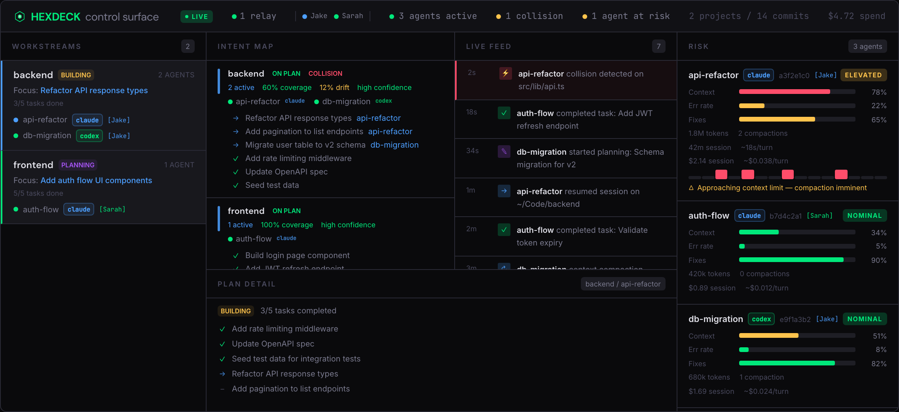
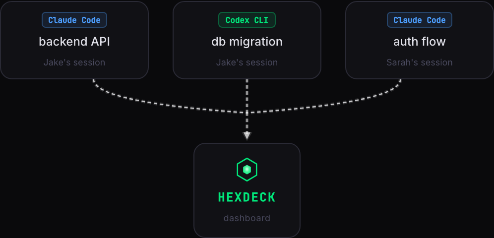
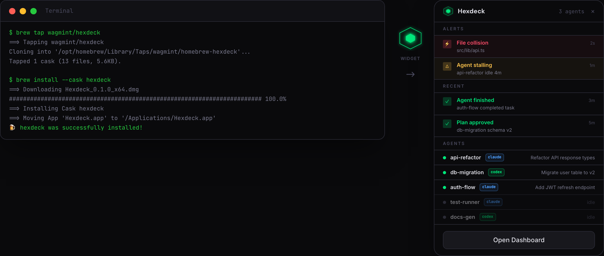
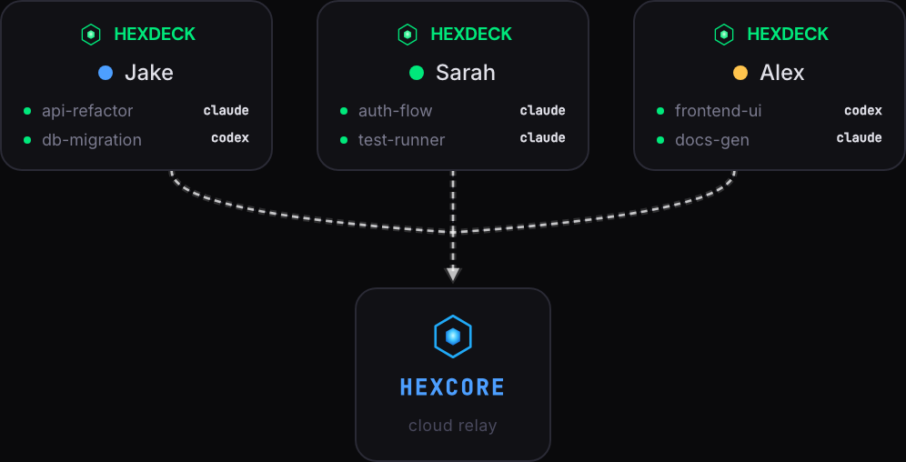

<p align="center">
  <picture>
    <source media="(prefers-color-scheme: dark)" srcset=".github/assets/hexdeck-mark.svg">
    
  </picture>
</p>

<h3 align="center">Hexdeck</h3>
<p align="center">Real-time observability for AI coding agents</p>

<p align="center">
  <a href="https://www.npmjs.com/package/@hexdeck/cli"></a>
  <a href="https://github.com/wagmint/hexdeck/actions"></a>
  <a href="LICENSE"></a>
</p>

---

Hexdeck reads local session logs from [Claude Code](https://docs.anthropic.com/en/docs/claude-code) and [Codex](https://github.com/openai/codex), parses them into structured turn-by-turn data, and serves a live dashboard showing what your agents are doing in real time. Part of [Hexcore](https://hexcore.app).

<p align="center">
  
</p>

## How sessions flow into Hexdeck

Any tool that writes session logs — Claude Code, Codex, or both — streams into the same dashboard.

<p align="center">
  
</p>

## Features

- **Live dashboard** — real-time view of all active agents, updated every second via SSE
- **Plan tracking** — see each agent's current task list and overall workstream progress
- **Collision detection** — catch when two agents edit the same uncommitted file before it becomes a merge conflict
- **Risk analytics** — context usage, error rates, spinning signals, compaction proximity, cost per session
- **Intent mapping** — track what agents intend to do vs. what they're actually doing
- **Live feed** — event stream of commits, errors, compactions, and plan changes across all projects
- **Multi-operator support** — one dashboard for every developer on the team via [Hexcore](#hexcore) relay

## macOS floating widget

Install via Homebrew for an always-on floating widget that shows agent status without opening a browser.

<p align="center">
  
</p>

## Install

**macOS app** (floating widget + full dashboard):

```bash
brew tap wagmint/hexdeck
brew install --cask hexdeck
```

**CLI** (cross-platform, dashboard in browser):

```bash
npm install -g @hexdeck/cli
hex start
```

Opens `http://localhost:7433` with the dashboard.

## Privacy

Hexdeck is 100% offline. Zero network requests unless you explicitly connect to Hexcore.

| | What |
|---|---|
| **Reads** | Session transcripts in `~/.claude/projects/` and `~/.codex/sessions/`. Does **not** read source files, env vars, or git credentials. |
| **Writes** | PID file (`~/.hexdeck/server.pid`), config (`~/.hexdeck/`), macOS app data in `~/Library/Application Support/dev.hexdeck.menubar`. |
| **Network** | None. Only outbound if you connect to Hexcore via `hex relay`. |
| **Telemetry** | None. No analytics, usage metrics, or tracking. |

## Commands

```bash
hex start                # Start server + dashboard (background)
hex start --foreground   # Start in foreground
hex start --port 8080    # Custom port
hex status               # Show running server info
hex stop                 # Stop the server
hex restart              # Restart
hex open                 # Open dashboard in browser
```

Relay commands (for [Hexcore](#hexcore) cloud coordination):

```bash
hex relay <connect-link>                    # Add/update relay target from cloud link
hex relay list                              # List relay targets
hex relay sessions                          # List active local sessions/projects
hex relay include <hexcoreId> <projectPath> # Start relaying a project
hex relay exclude <hexcoreId> <projectPath> # Stop relaying a project
hex relay remove <hexcoreId>                # Remove relay target
```

## API

JSON API at `localhost:7433/api/` for building your own tooling.

| Endpoint | Description |
|---|---|
| `GET /api/projects` | List all projects with Claude Code and Codex sessions |
| `GET /api/projects/:name/sessions` | List sessions for a project |
| `GET /api/sessions/:id` | Parsed session with turn nodes and stats |
| `GET /api/sessions/active` | Currently active sessions |
| `GET /api/dashboard` | Full dashboard state |
| `GET /api/dashboard/stream` | SSE stream of dashboard updates |
| `GET /api/health` | Health check |

## How it works

Claude Code stores session data under `~/.claude/projects/` and Codex stores session logs under `~/.codex/sessions/`. Hexdeck scans both sources, parses the events into structured **turn-pair nodes** (one user message + everything the agent did in response), and computes dashboard state including active agents, file collisions, risk signals, and a live feed.

The server is a single [Hono](https://hono.dev) process that serves both the API and the static dashboard.

## Development

```bash
git clone https://github.com/wagmint/hexdeck.git
cd hexdeck
npm install
npm run dev    # Next.js on :3000 + API on :7433
```

Build everything:

```bash
npm run build  # Builds dashboard-ui, dashboard, server, and CLI
```

## Requirements

- Node.js >= 20
- Claude Code and/or Codex installed (session logs in `~/.claude/projects/` and `~/.codex/sessions/`)

## Hexcore

For multi-machine coordination, connect Hexdeck instances through [Hexcore](https://hexcore.app) — a cloud relay that shares operator state across your team in real time.

<p align="center">
  
</p>

- [Hexcore](https://hexcore.app)
- [Documentation](https://hexcore.app/docs)

## Contributing

See [CONTRIBUTING.md](CONTRIBUTING.md) for development setup and guidelines.

## License

[MIT](LICENSE)
